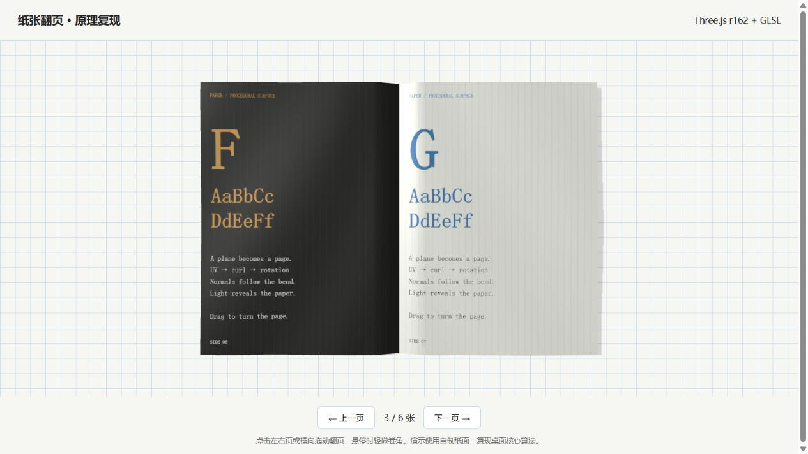

# Page Curl Skill

可离线复现的 Three.js 书本翻页技能，包含固定版本运行时、可读着色器、页面图片导入和回归测试。基于对 Paper Mono 效果的观察独立实现，未包含其美术资源或原站源码。



## 安装技能

将 `skills/page-curl` 文件夹复制到 `~/.codex/skills/page-curl`，重新加载技能后使用：

> 使用 $page-curl 制作一个书本翻页效果，并验证白纸翻页、拖拽回弹和落地稳定性。

也可让 Codex 的 skill-installer 从本仓库的 `skills/page-curl` 路径安装。

## 生成离线演示

需要 Node.js 18+，无需安装 npm 依赖：

```sh
node skills/page-curl/scripts/create-demo.mjs --output book.html
node skills/page-curl/scripts/self-test.mjs
npm test
```

双击生成的 `book.html` 即可打开。仓库内的 `example.html` 是已生成的离线示例。

导入自己的页面：

```json
{"title":"My magazine","startSheet":1,"pages":["a.png","b.png","c.png","d.png"]}
```

```sh
node skills/page-curl/scripts/create-demo.mjs --config book.json --output book.html
```

每两张图片对应一张纸的正反面；图片路径相对于配置文件。建议图片宽高比 1:1.377。页面与 Three.js 都会嵌入 HTML，生成后无需网络。

## 稳定性

- 纸层高度由纸张编号和连续翻页进度计算，避免翻页/落地时突然穿插。
- 明确双面法线方向，深度材质与可见材质共用形变。
- 自动翻页及落地期间暂停悬停卷角，结束后等待新的鼠标移动。
- 支持点击、拖拽提交、短拖拽回弹、取消、边界和重复输入隔离。
- 固定 Three.js 0.162.0；升级前运行着色器兼容验证。

自动测试覆盖状态和时间连续性，但不能替代真实 GPU 画面检查。参见技能内的 `references/verification.md`。这是桌面圆柱卷曲模型，也接受窄屏指针输入；未实现 Paper Mono 的专用移动圆锥模型、真实布料物理或完整纸墨材质。

## License

原创代码和技能文档采用 MIT。内嵌 Three.js 的许可证见 `skills/page-curl/assets/THREE-LICENSE.txt`。灵感来源：[Paper Mono](https://paper.design/mono)。
